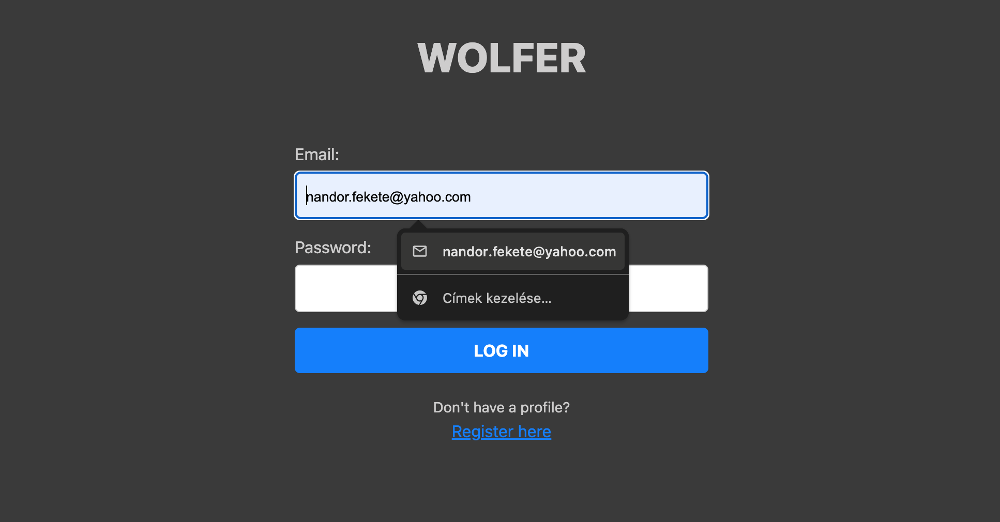
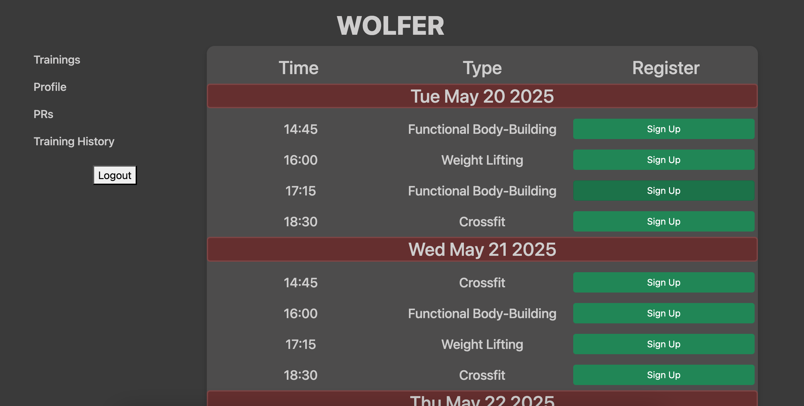

# 🐺 Wolfer

**Wolfer** is a web application that allows trainers to create and manage trainings, while users can sign up, maintain their profiles, and track personal bests. Wolfer was developed showcasing a React.js (Vite) frontend, connected to a ASP.NET backend, using an MSSQL database. During development SOLID principles were followed and Clean Code methodology was maintained. Different layers of the application are thoroughly tested. This is a solo project.

## Snapshots

### Login


### Trainings Table


---

## 1. 🚀 Features

- 👤 User profiles
- 🏋️ Trainers can create/manage trainings
- 📅 Users can sign up for trainings
- 📈 Track personal bests and training progress
- 🔒 Authentication (2FA ready)

---

## 2. 🧱 Tech Stack

- **Frontend:**
[![npm][npm-logo]][npm-link]
[![React][React.js]][React-url]
- **Backend:**
[![ASP.NET Core][AspNet-logo]][AspNet-url]
[![C#][Csharp-logo]][Csharp-url]
- **Database:**
[![MSSQL][Mssql-logo]][Mssql-url]
[![Entity Framework][Ef-logo]][Ef-url]
- **Containerization:**
[![Docker][Docker-logo]][Docker-url]
- **Version Control:**
[![Git][Git-logo]][Git-url]
[![GitHub][Github-logo]][Github-url]

- **Frontend**: React (Vite, Bootstrap)
- **Backend**: ASP.NET Core (C#)
- **Database**: SQL Server
- **Dev Tools**: Docker, Rider, VSCode

---

## 3. 🖥️ Running the Project Locally

### 3.1 ⚙️ Prerequisites

- [.NET SDK](https://dotnet.microsoft.com/en-us/download)
- [Node.js & npm](https://nodejs.org/)
- [Docker](https://www.docker.com/)

---

### 3.2. Starting the Backend

```bash
cd Wolfer
dotnet restore
dotnet run
```

### 3.3. Starting the Frontend
```bash
cd Wolfer
cd wolfer_frontend
npm install
npm run dev
```

## 4. Architecture
The project is built with a RESTful API backend and a component-based frontend.

## 5. Contribution

1. Fork the repository  
2. Create a new branch  
   ```bash
   git checkout -b your-feature-branch
   ```
3. Submit a Pull Request (PR)

## 6. Contact
**Developer:** Nándor Fekete  
**Email:** [nandor.fekete@yahoo.com](mailto:nandor.fekete@yahoo.com)  
**LinkedIn:** [https://www.linkedin.com/in/nándor-fekete-fn97](https://www.linkedin.com/in/nándor-fekete-fn97)

## 7. 📌 [Project Board (Backlog)](https://github.com/users/nandorfekete97/projects/2/views/1)

[React.js]: https://img.shields.io/badge/React-20232A?style=for-the-badge&logo=react&logoColor=61DAFB
[React-url]: https://reactjs.org/
[AspNet-logo]: https://img.shields.io/badge/ASP.NET_Core-5C2D91?style=for-the-badge&logo=dotnet&logoColor=white
[AspNet-url]: https://dotnet.microsoft.com/en-us/apps/aspnet
[Csharp-logo]: https://img.shields.io/badge/C%23-239120?style=for-the-badge&logo=csharp&logoColor=white
[Csharp-url]: https://learn.microsoft.com/en-us/dotnet/csharp/
[Mssql-logo]: https://img.shields.io/badge/Microsoft_SQL_Server-CC2927?style=for-the-badge&logo=microsoft-sql-server&logoColor=white
[Mssql-url]: https://www.microsoft.com/en-us/sql-server
[Ef-logo]: https://img.shields.io/badge/Entity_Framework-512BD4?style=for-the-badge&logo=.net&logoColor=white
[Ef-url]: https://learn.microsoft.com/en-us/ef/
[Docker-logo]: https://img.shields.io/badge/Docker-2496ED?style=for-the-badge&logo=docker&logoColor=white
[Docker-url]: https://www.docker.com/
[Git-logo]: https://img.shields.io/badge/Git-F05032?style=for-the-badge&logo=git&logoColor=white
[Git-url]: https://git-scm.com/
[Github-logo]: https://img.shields.io/badge/GitHub-181717?style=for-the-badge&logo=github&logoColor=white
[Github-url]: https://github.com/
[npm-logo]: https://img.shields.io/badge/npm-CB3837?style=for-the-badge&logo=npm&logoColor=white
[npm-link]: https://www.npmjs.com/
